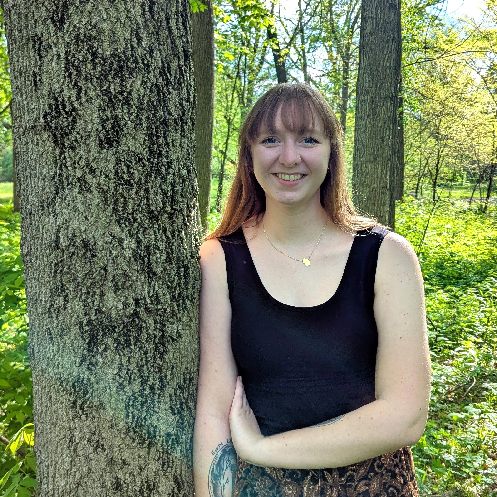

## About Me
I am a master's student in the Ecology and Evolutionary Biology Department at the University of Connecticut. My research interests involve using genomics and bioinformatics to study forest pathogens, and I have a particular interest in fungal pathogens and conifer genomes.

[My CV](PDFs/cv.pdf)

[Contact Info](contact-info.html)

